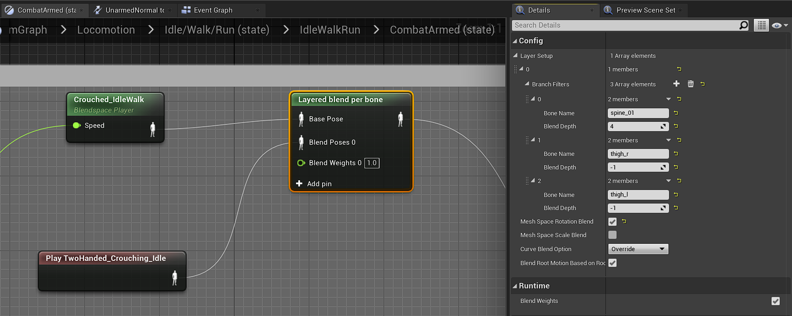

If the Player presses the 'Ctrl' key when in game, the Character will crouch. When crouched, walking speed is reduced, and 
the Character also cannot jump *(might be changed)* nor sprint.

A separate Crouched BlendSpace is used for the Movement Animations of the Character when crouched. 

When the Character is in either the *Armed-OneHanded* or *Armed-TwoHanded* mode, it's Idle Animation is Blended with the Crouched BlendSpace
i.e the Idle Animation will play above the Pelvis, while the Crouched BlendSpace will play below the Pelvis.

For now, there is only one Attack Animation for the Character. I will add more when I can find them in Mixamo or when I make them 
myself in Blender (Which I hope to do soon).

You can view the code of the project [here](https://github.com/1Gokul/MedievalCombatProject)!

#### In Action 

- While Unarmed
<iframe src="https://www.youtube.com/embed/ANRftv35JLg" width="560" height="315" frameborder="0"> </iframe> 

- While Armed with a One-Handed Weapon
<iframe src="https://www.youtube.com/embed/aOBET37kOE4" width="560" height="315" frameborder="0"> </iframe> 

- While Armed with a Two-Handed Weapon (Bug: Character rises above the ground. Will be patched soon.)
<iframe src="https://www.youtube.com/embed/CrWMZnb89TQ" width="560" height="315" frameborder="0"> </iframe> 

