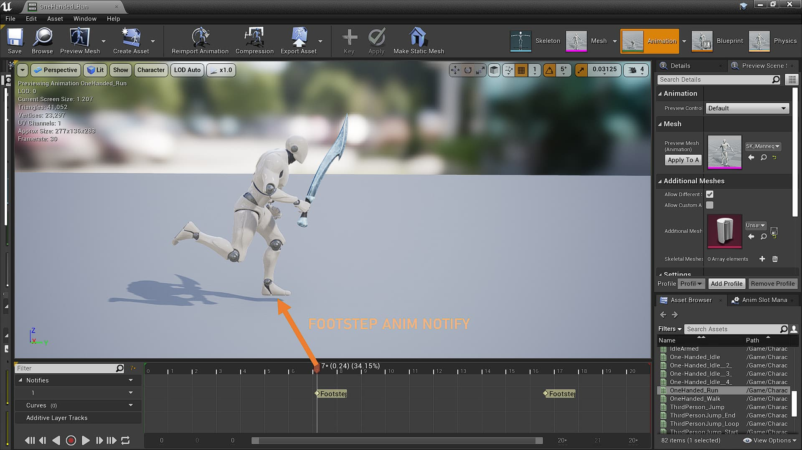

Now when the Character's foot hits the ground while Running or Sprinting, a sound will be played at the location where the foot fell.
The sound played also depends on the type of the ground e.g. Stone, Marble, Land, Water, Wood.

Firstly, I made 2 functions- one for the logic(finding out the ground type) and the other to play the sound itself.

The first one is `Footstep()`. It is a `BlueprintCallable` function called in Blueprints by an Anim Notify called `Footstep`.

The `Footstep` Anim Notify is triggered at the moment the Character sets their foot down in the Movement Animations.



## Footstep()

This function does a [Raycast by Channel](https://docs.unrealengine.com/en-US/Engine/Physics/Tracing/HowTo/SingleLineTraceByChannel/index.html)
from the Character to the ground.

If the Raycast successfully hits something and we are able to check if it has any Physical Material, we
call `PlayFootstepSound()`, passing an enum `EPhysicalMaterials` and the Location to play the Footstep sound.

_(I had initially thought of just passing integers to identify the type of Physical Material, but made the `EPhysicalMaterials`
enum class instead for readability.)_

**IMPORTANT**: To make sure the Hit Result returns a Physical Material, you must set _YOUR_TRACE_PARAM_NAME.bReturnPhysicalMaterial_ to
`true` before the raycast.

```cpp
void AMain::Footstep()
{
	// Line-trace will start from the Character's location to a point 500 units below it.
	FVector Start = GetActorLocation();
	FVector End = Start - FVector(0.0f, 0.0f, 500.0f);

	// Hit result
	FHitResult OutHit;


	FCollisionQueryParams CollisionParams;

	// Ignore the Character during the Line-trace
	CollisionParams.AddIgnoredActor(this);

	// Make sure the Line-trace returns the Physical Material of the object it hits
	CollisionParams.bReturnPhysicalMaterial = true;

	// Line-trace from the Character to the ground
	bool Success = GetWorld()->LineTraceSingleByChannel(OutHit, Start, End, ECollisionChannel::ECC_Visibility, CollisionParams);

	// If the line-trace was successful
	if(Success)
	{
		EPhysicalMaterials PhysicalMaterial;

		// Find out the name of the Physical Material that the line-trace hit
		UObject* PhysMatObject = Cast<UObject>(OutHit.PhysMaterial.Get());

		if(PhysMatObject){

			FName PhysMatObjectName = PhysMatObject->GetFName();

			// Assign the EPhysicalMaterials enum value accordingly
			if(PhysMatObjectName == "DefaultPhysicalMaterial"){
				PhysicalMaterial = EPhysicalMaterials::EPM_Land;
			}

			else if(PhysMatObjectName == "PhysicalMaterial_Land"){
				PhysicalMaterial = EPhysicalMaterials::EPM_Land;
			}

			else if(PhysMatObjectName == "PhysicalMaterial_Stone"){
				PhysicalMaterial = EPhysicalMaterials::EPM_Stone;
			}

			else if(PhysMatObjectName == "PhysicalMaterial_Wood"){
				PhysicalMaterial = EPhysicalMaterials::EPM_Wood;
			}

			else if(PhysMatObjectName == "PhysicalMaterial_Water"){
				PhysicalMaterial = EPhysicalMaterials::EPM_Water;
			}

			else{
				PhysicalMaterial = EPhysicalMaterials::EPM_Land;
			}

			// Play the sound
			PlayFootstepSound(PhysicalMaterial, OutHit.ImpactPoint);

			UE_LOG(LogTemp, Warning, TEXT("Material Name: %s"), *OutHit.PhysMaterial.Get()->GetFName().ToString());
		}
	}
}
```

## PlayFootstepSound()

This function receives the Physical Material type and Location and plays the Footstep sound.

To store the Footstep sounds, I made two TArrays of type `USoundCue*`, one for Footsteps while running, and the other for sprinting.
`RunningFootstepSounds` and `SprintingFootstepSounds` store all the Sound Cues for Running and Sprinting respectively.

Each Physical Material has 5 sounds each for both TArrays, out of which one sound will be picked at random.

```cpp
void AMain::PlayFootstepSound(EPhysicalMaterials& PhysicalMaterial, FVector& LocationToPlayAt)
{
	// Get the integer value of the enum variable
	const int32 PhysicalMaterialInt = static_cast<int32>(PhysicalMaterial);

	/**
	 * Each type of Physical material has indexes as below:
	 *
	 *	FYI: The '5' below is NumberOfFootstepSounds.
	 *
	 * {Index} - Name - [(5 * Index) -> ((5 * (Index + 1)) - 1)]
	 * {0} - Land - [0 -> 4]
	 * {1} - Stone - [5 -> 9]
	 * {2} - Wood - [10 -> 14]
	 * {3} - Water - [15 -> 19]
	 */

	int32 RandIndex = FMath::RandRange(NumberOfFootstepSounds * PhysicalMaterialInt, (NumberOfFootstepSounds * (PhysicalMaterialInt + 1) - 1));

	if (MovementStatus == EMovementStatus::EMS_Normal)
	{
		// If the index decided is valid, play the Running footstep sound.
		if (RunningFootstepSounds.IsValidIndex(RandIndex))
		{
			UGameplayStatics::PlaySoundAtLocation(GetWorld(), RunningFootstepSounds[RandIndex], LocationToPlayAt,
			                                      FRotator(0.0f, 0.0f, 0.0f));
		}
	}
	else if (MovementStatus == EMovementStatus::EMS_Sprinting)
	{
		// If the index decided is valid, play the Sprinting footstep sound.
		if (SprintingFootstepSounds.IsValidIndex(RandIndex))
		{
			UGameplayStatics::PlaySoundAtLocation(GetWorld(), SprintingFootstepSounds[RandIndex], LocationToPlayAt,
			                                      FRotator(0.0f, 0.0f, 0.0f));
		}
	}
}
```

You can view the code of the project [here](https://github.com/1Gokul/MedievalCombatProject)!

## In Action:

- Footsteps on Wood

  <iframe
    src="https://www.youtube.com/embed/DNbTKY93jek"
    width="100%"
    height="300px"
    frameborder="0"
allowfullscreen
  ></iframe>

- Footsteps on Stone&Land
  <iframe
    src="https://www.youtube.com/embed/Ik2yjpyqa1g"
    width="100%"
    height="300px"
    frameborder="0"
allowfullscreen
  ></iframe>
