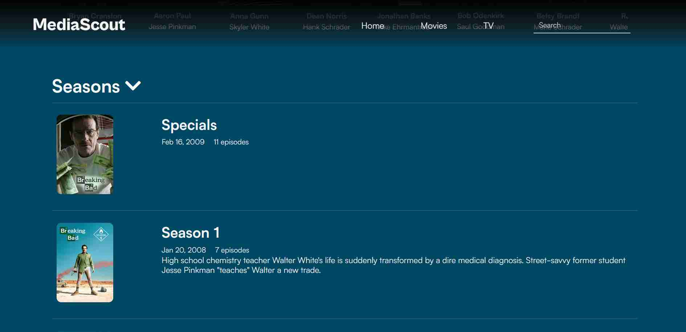

MediaScout is a webapp that takes information of movies, tv series and actors from an API and shows it to the user.
Users can also search for media and see similar movies and shows by genre/keywords.

### Motivation

I planned to make this project to learn how to work with APIs better with varying types of requests and parameters.
I chose to user the [TMDB API](developers.themoviedb.org) to query and display results as it was well-known, easy to use, and did not have any rate limits
and was completely free.

Like the previous project, I used vanilla HTML, CSS(with Bootstrap) and JS for the frontend and a Flask API for the backend.

## The structure

The project mainly had 4 sections:

- Home
- Movies
- TV
- Search Results

The Home, Movies and TV sections would make requests to the API for media of a particular category like
_Trending_, _New Releases_, _Top Rated_ or by genre like Documentaries, Crime, Animation.

This is how the main movie page looks like:


An example of a request made to the API:

```python
def info_by_category(self, category_after, media_type, category_before=None):
    """Returns the information on media of a particular category like 'trending' or 'popular'."""
    return self.get_general_info(
        f"https://api.themoviedb.org/3{ ('/' + category_before) if category_before else ''}/{media_type}/{category_after}",
        media_type=media_type,
    )
```

## Storing homepage data in databases

The above code snippet is to get the information of **ONE** category of media. For a homepage, this means the site will have
to make multiple concurrent requests to the API. I can load the data asynchronously, but the pages would still be _heavily_
slowed down and this would lead to a bad experience for any user.

I then decided that the best alternative would be to store the homepage data in a database. This would speed up the loading time
as no requests would be made to the API.

Updating the data, however, was a problem I had not handled before.

After some digging, I set up pymongo and a database on [MongoDB Atlas](https://www.mongodb.com/cloud/atlas/register). It's free and more
than enough for small projects.

The process was simple:

```python
tv_home = db.media_data.update_one(
    {"page": "tv_home"},
    {"$set": {"content": get_tv_home_info()}},
    upsert=True,
)
```

<note>
  P.S. "Upsert = True" means that the data should be inserted even if there is
  no matching document in the collection. This helps when the database is
  cleared and there is no document to match with.
</note>

I then created a `/update-db/<id>` route on the application to handle a route and take a parameter `id`. This would
later get changed to a simple POST request with the id in the passed JSON.

The `id` is a [UUID](https://en.wikipedia.org/wiki/Universally_unique_identifier)
and would be compared to the id stored as a environment variable every time the path `/update-db`
was visited. If the id did not match, the user would get a
[403](https://developer.mozilla.org/en-US/docs/Web/HTTP/Status/403) response. As a result, only those
with the correct ID would be able to update the database. This was to prevent overloading the TMDB API with requests.

Updating the DB _periodically_ meant using a [cron job](https://en.wikipedia.org/wiki/Cron) that would ping the `/update-db`
route at a specefic time every day. While we can set up our cron jobs on our own servers, for such small operations,
[GitHub Actions](https://github.com/features/actions) was my first option. The advantage it had was being _really_ easy to
set up in the repo as it was a feature in GitHub itself.

To set it up, I created a file called `update_database.yml` in a folder `workflows` in the `.github` folder. This would tell
GitHub that the `.yml` file is meant to be used for an Action.

The contents of the file are as follows:

`update_database.yml`

```yaml
# The name of the action
name: Refresh database with updated media data

on:
  schedule:
    # Run at 6 AM every day
    - cron: "0 6 * * *"
jobs:
  update-database:
    runs-on: ubuntu-latest
    steps:
      - name: trigger-update
        run: |
          curl --location --request POST 'https://mediascout.herokuapp.com/update-db' \
          --header 'Content-Type: application/json' \
          --data-raw '{"auth_code": "${{secrets.UPDATE_TOKEN}}"}'
```

As you can see above, the job is set to run on a schedule and has only one step. If you want to learn more,
visit [crontab.guru](https://crontab.guru) to get a better undertanding of the syntax.

So, at that particular time, the server hosting the action would send a POST request to the `/update-db` route with the
`id`. The app would then check the ID and start updating the database.

As a result, the homepage issues were sorted out!

## Viewing media details

Once a thumbnail is clicked, another request is made to the API, asking for the details of the media.

I initially used to just pass all of the results to the template without formatting and placed all logic into the templates.
[This paragraph](https://jinja.palletsprojects.com/en/3.0.x/faq/#isn-t-it-a-terrible-idea-to-put-logic-into-templates),
however, changed my mind and I transferred most of the logic to the backend while just displaying them in the template.

The [`simplify_response()`](https://github.com/1Gokul/MediaScout/blob/5092d452d3f5d05dfe4b91d77cae380b7494f357/media_finder.py#L415)
function contains most of the logic transferred from the templates. It mostly converts linkable data to links (like actor details) and
simplifies the rest of the results to show just the main information like Directors, Languages, Companies, etc.

This is how a media detail page looks like:


### TV details

If the media being viewed is of a series, the seasons and their descriptions are also shown to the user.



The seasons too, can be clicked to show small descriptions of each episode.


## Actor information

Information of actors (description and filmography) can also be searched and viewed. The information is requested in a
similar fashion to the movie/tv details.


## Searching by query and by keywords

After the description of every Movie/Series, tags given by the TMDB API are shown and can be clicked to view similarly tagged media.

On the navbar is a searchbar, through which users can search for media by a query.

The pagination for the results was also relatively easy to implement, as I had to just pass in a page number to the API to get
another set of results.


## Finishing up

In the end, this project(although less challenging than [table2markdown](/blog/table2markdown-project)) taught me a lot about
interacting with APIs, using databases and speeding up pages as much as possible.

[You can view the project here!](https://mediascout.herokuapp.com/)

Thanks for reading!
