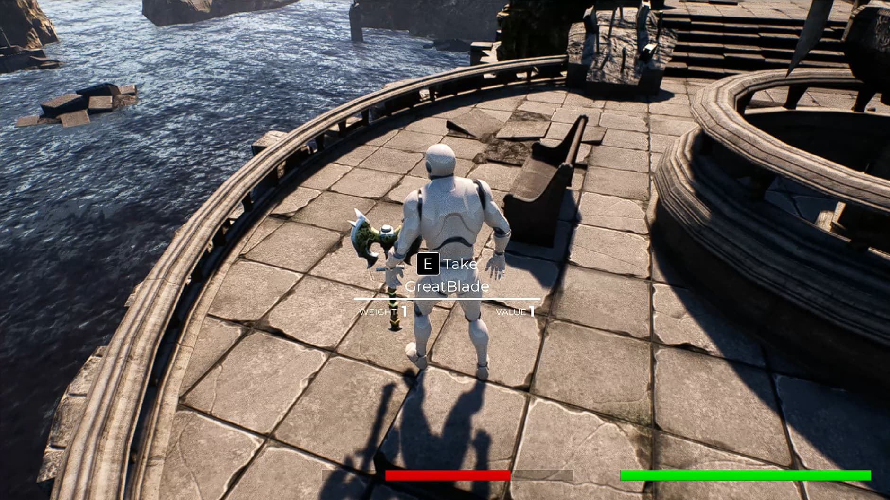
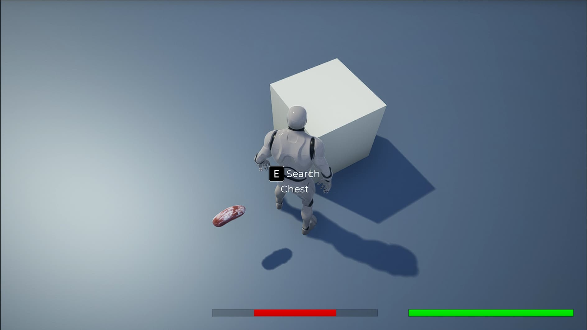

The ItemInteract or Search prompts appear when the Character overlaps with an Object that they can interact with.

## The prompts

If overlapping with an Item, the ItemInteract prompt will appear prompting the Player to take the Item, also showing the Weight and Value
of the Item.



If overlapping with a Container, the Search prompt will appear prompting the Player to search the Container.



This was done by creating four `BlueprintNative` functions, two each for the ItemInteract and Search prompts
(One for displaying and the other for removing the prompt).

When the Character overlaps with the CollisionVolume of the object, the `OnOverlapBegin` function of the object is called, which in
turn calls the above `BlueprintNative` functions to create a widget and show the prompt.

When the Character leaves the CollisionVolume of the object, the `OnOverlapEnd` function of the object is called, which also in
turn calls the `BlueprintNative` functions to remove the prompt.

Logic for displaying and removing the widget has been done in Blueprints as it is much easier.

The virtual `OnOverlapBegin(...)` function below has been defined in the `Item` parent class. Also, every child `Item` that overrides this function
also calls the parent's version, using `Super::OnOverlapBegin(...)`.

## OnOverlapBegin()

```cpp
void AItem::OnOverlapBegin(UPrimitiveComponent* OverlappedComponent, AActor* OtherActor, UPrimitiveComponent* OtherComp,
                           int32 OtherBodyIndex, bool bFromSweep, const FHitResult& SweepResult)
{
	// Check if the OtherActor is the Character
	AMain* Main = Cast<AMain>(OtherActor);

	if(Main)
	{
		// If it is, display the Item Interact Prompt.
		if(Main->MainPlayerController)
		{
			// ItemInteract text has been defined as "Take".
			Main->MainPlayerController->DisplayItemInteractPrompt(ItemStructure.ItemDisplayName.ToString(), ItemStructure.Weight, ItemStructure.Value, ItemInteractText);
		}
	}
}
```

The Item's Name, Weight and Value are passed through and are used in the `MainPlayerController`'s Blueprint like so:

_(Move the mouse while holding the Right Mouse Button down to see the entire Blueprint.)_

<iframe
  src="https://blueprintue.com/render/s06cjcma"
  width="100%"
  height="400px"
  scrolling="no"
  allowfullscreen
></iframe>

Similarly, the virtual `OnOverlapEnd` function below is defined in the `Item` class and is called by the children classes which override the function.

## OnOverlapEnd()

```cpp
void AItem::OnOverlapEnd(UPrimitiveComponent* OverlappedComponent, AActor* OtherActor, UPrimitiveComponent* OtherComp,
                         int32 OtherBodyIndex)
{
	// Check if the OtherActor is the Character
	AMain* Main = Cast<AMain>(OtherActor);

	if(Main)
	{
		// If it is, display the Item Interact Prompt.
		if(Main->MainPlayerController)
		{
			Main->MainPlayerController->RemoveItemInteractPrompt();
		}
	}
}
```

The Blueprint implementation to remove the prompt is as follows:

_(Move the mouse while holding the Right Mouse Button down to see the entire Blueprint.)_

<iframe
  src="https://blueprintue.com/render/zozqtwx9"
  width="100%"
  height="400px"
  scrolling="no"
  allowfullscreen
>
  {" "}
</iframe>

## In Action

- ItemInteract Prompt

  <iframe
    src="https://www.youtube.com/embed/3ONy3fMEnmE"
    width="100%"
    height="300px"
    frameborder="0"
allowfullscreen
  ></iframe>

- Search Prompt
  <iframe
    src="https://www.youtube.com/embed/s4wPKBajsEo"
    width="100%"
    height="300px"
    frameborder="0"
allowfullscreen
  ></iframe>

You can view the code of the project [here](https://github.com/1Gokul/MedievalCombatProject)!
