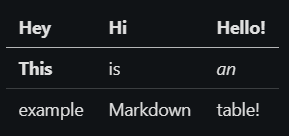
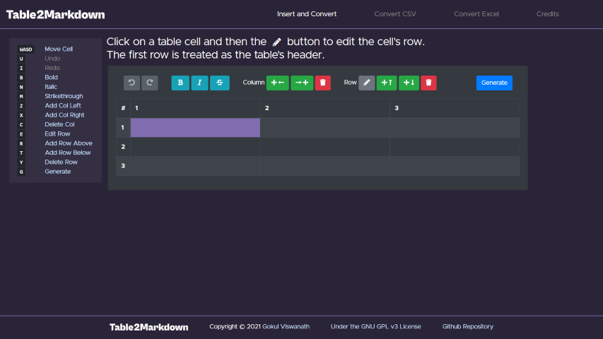
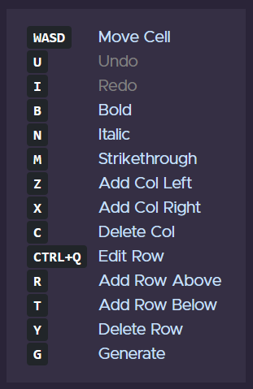
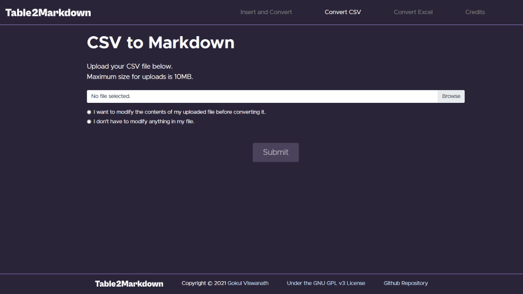
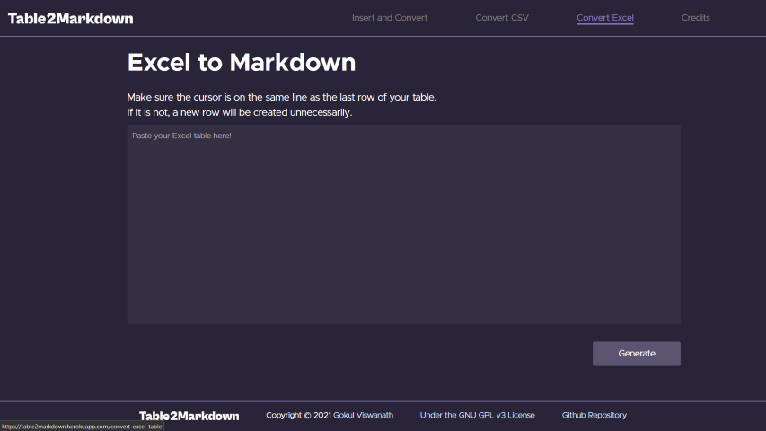

# Table converter project

[pic2ascii](https://gokulv.netlify.app/blog/pic2ascii-converter/) taught me a lot about about styling with CSS and how to structure HTML documents properly. 
I also learnt how to accept files, process them and send them back to the user.

While building the project, I had to create a table of items and then store it in Markdown. After some searching, 
I found a website that helped me do it: [TablesGenerator](https://www.tablesgenerator.com/markdown_tables), where I 
entered items and then could convert it into markdown text. 

This is an example table created with the website:

```md
| Hey | Hi | Hello! |
| --- | --- | ------ |
| **This** | is | *an* |
| example | Markdown | table! |
```
This is the result:



I then started to create a clone of the website, with all the website's other functionalities, like converting 
a CSV file or an Excel table.

I also decided to use a CSS framework to style my website, as I was comfortable with CSS at that time. For that purpose,
I picked [Bootstrap](https://getbootstrap.com/). This also helped make the website responsive for 
mobile devices with little to no effort.

For the backend, I picked Flask as I was still inexperienced in it and wanted to learn more. 

## Sections of the project

There were three sections:

1. Inserting Data and converting
2. Uploading a CSV file
3. Pasting an Excel table


Conversion was the same for each part. The first row of the table was always treated as the header.
Iterating through the rows, the program surrounds the cells with pipes (`|`) and spaces in between, while also 
formatting them properly. Here is a snippet of the code:

`converter.py`

```python
# convert_type is either 'i2m'(insertedTable-to-Markdown) or 'c2m'(CSV-to-Markdown).
def convert_table(input_data, convert_type, file_id):
    result_table = ""

    # Add the first row of the input table. It will be treated as the header of the output table.
    result_table += "|"
    for i in range(len(input_data[0])):

        if convert_type == "i2m":
            # If converting from HTML, check for formatting.
            inputText = check_for_formatted_text(input_data[0][i])
            result_table += " " + inputText + " |"
        else:
            result_table += " " + input_data[0][i] + " |"

    result_table += "\n"

    # Add the hyphens below to make the header
    result_table += "|"
    for i in range(len(input_data[0])):
        result_table += " "

        # The number of hyphens to add
        current_column_length = len(input_data[0][i])
        current_column_length = max(
            3, current_column_length
        )  # 3 is the minimum number of hyphens to be added

        if convert_type == "i2m":
            if current_column_length > 0:

                # Formatting characters are not counted towards the number of hyphens.
                # If bold characters exist
                if "<b>" in input_data[0][i]:

                    # <b></b>(7 characters) - ****(4 characters) is 3
                    current_column_length -= 3

                # If italic characters exist
                if "<i>" in input_data[0][i]:
                    # <i></i>(7 characters) - **(2 characters) is 5
                    current_column_length -= 5

                # If strikethrough characters exist
                if "<del>" in input_data[0][i]:

                    # <del></del>(11 characters) - ~~~~(4 characters) is 7
                    current_column_length -= 7

        for j in range(current_column_length):
            result_table += "-"

        result_table += " |"

    result_table += "\n"

    # Add the contents of the table's body
    for i in range(1, len(input_data)):
        result_table += "|"
        for j in range(len(input_data[i])):

            if convert_type == "i2m":
                # If converting from HTML, check for formatting.
                inputText = check_for_formatted_text(input_data[i][j])
                result_table += " " + inputText + " |"
            else:
                result_table += " " + input_data[i][j] + " |"

        result_table += "\n"

    # Write the results to a file
    write_result_to_file(result_table, file_id, also_write_to_md=True)

    response_object = {"resultTable": result_table, "resultFileID": file_id}

    return response_object
```

After this conversion, the results are returned to the user **while also** writing the results to a text file and Markdown
file in case the user wishes to download their results or view the raw text.

**DISCLAIMER**: These temporary files cannot be read by me or ANYONE and reside on Heroku's 
[ephemeral filesystem](https://devcenter.heroku.com/articles/dynos#ephemeral-filesystem), which is cleared every time the 
dynos are restarted, so absolutely **zero** data from the user is kept.

## Inserting Data and converting



This was honestly the hardest one of them all. For this, I had to have an editable table where each cell and row can be selected
and edited with options like **Bold**, *Italic* and <ins>Underlined</ins> text, along with buttons to add and delete rows 
and columns in each direction.

I was able to get the table editable by adding a JQuery *(yeah I know, I got around to using ES6 later)* plugin to add, edit
and delete rows. Column add/removal/deletion was done by yours truly. I also learnt how to use JQuery animations to hide and show
different buttons.

Another hard part was adding Undo/Redo functionality. I created a history array that stored the last 10 actions of the user. Once an action is performed in the middle of history, the elements in front were deleted. It was fun as I had to rack my brains to 
implement it properly. 

### Accessibility

This was a major thing I wanted to implement as it would be beneficial to users without mice. Additionally,
operations on the rows and columns is a repetetive process. I then added events to perform actions on certain keypresses and showed 
a guide to the user, like so:

   

The controls shown in the guide also change depending on the context i.e. only those controls are shown which can be pressed 
in that particular situation.

<Image src="keyguides_changing.gif" width="250"/>


## Converting CSV files



This was relatively simple compared to the first part and was a good change in pace. In this method, I used the lightweight 
but powerful [Papaparse](https://www.papaparse.com/) library to quickly parse the uploaded CSV files in the client-side 
itself, before sending the file to the backend.

Before submitting the file, the user is given the choice to either directly convert and download the file, or further edit the
converted CSV table before downloading.

Server-side, the csv file could be accessed easily and converted to a table using the function `convert_table()` shown above.


Once completed, the user is directed to the insert-and-convert page in case they chose to edit the table, or they are shown the 
download links.

I used [uuid](https://docs.python.org/3/library/uuid.html)s to generate unique tables for the users to handle multiple users
simultaneously.

## Converting Excel tables



This was the easiest one. Excel stores the elements with tabs in between them, so all I had to do was split the input and 
convert them using the usual function.

`converter.py`
```python
# Parses the passed excel table and puts the content into an array.
# The array is then passed to the convert_table() function.
def convert_excel(input_table, file_id):
    result_table = []
    rows = input_table.split("\n")

    for col in rows:
        cells = col.split("\t")
        result_table.append(cells)

    response_object = convert_table(result_table, "c2m", file_id)

    return response_object
```

Overall, this was a great project, and I felt accomplished after finishing it to its entirety *(barring some bugs I still stumble on)*.

[You can check out the app here!](https://table2markdown.herokuapp.com)

**Onward!**