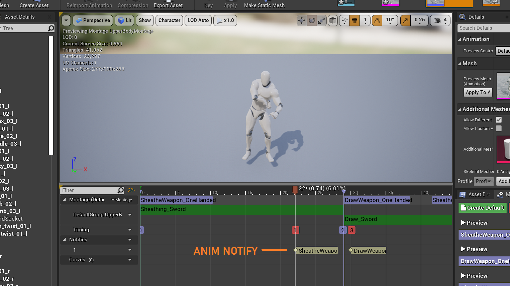
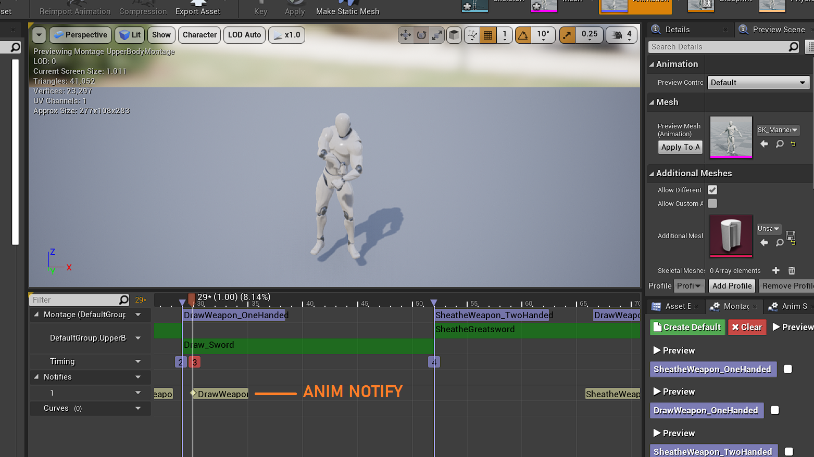

When the Player presses the **R** key, the Character changes into *Combat Mode*, which makes them ready for combat.

If the Character has a Weapon equipped, pressing **R** would toggle Sheathing and Drawing the Weapon.
If no Weapon was equipped, the Character would be ready for melee combat.

Sheathing and Drawing is done in two parts: the first being setting up the Character for combat and the second
being the attachment of the Weapon to the Hand/Sheath.

#### Sheathing Setup
```cpp
void AMain::SheatheWeapon()
{
	bInCombatMode = false;
	bAttacking = false;


	if (bIsWeaponDrawn && EquippedWeapon)
	{
		bIsWeaponDrawn = false;

		// Play the Sheath sound
		if (EquippedWeapon->OnSheathSound)
		{
			UGameplayStatics::PlaySound2D(this, EquippedWeapon->OnSheathSound);
		}

		// Play the Sheath Animation
		UAnimInstance* AnimInstance = GetMesh()->GetAnimInstance();

		if (AnimInstance && UpperBodyMontage)
		{
			AnimInstance->Montage_Play(UpperBodyMontage, 1.0f);

			if (EquippedWeapon->bIsTwoHanded)
				AnimInstance->Montage_JumpToSection(FName("SheatheWeapon_TwoHanded"), UpperBodyMontage);

			else AnimInstance->Montage_JumpToSection(FName("SheatheWeapon_OneHanded"), UpperBodyMontage);
		}
	}
}
```

The above function sets up the Character for Sheathing the Weapon. Attaching the Weapon to the Sheath is done 
by a *BlueprintCallable* function, `TimedSheathe`:

#### TimedSheathe()
```cpp
void AMain::TimedSheathe()
{
	if (EquippedWeapon)
	{
		EquippedWeapon->DeactivateCollision();

		EquippedWeapon->SetInstigator(nullptr);

		const USkeletalMeshSocket* SheathSocket = GetMesh()->GetSocketByName(EquippedWeapon->SheathSocketName);

		if (SheathSocket)
		{
			SheathSocket->AttachActor(EquippedWeapon, GetMesh());
		}
	}
}	
```

This function is called as an Anim Notify in the Sheathing Animation, at the moment where the Character is about to release the Weapon.



#### Drawing Setup
```cpp
void AMain::DrawWeapon()
{
	bInCombatMode = true;

	if (!bIsWeaponDrawn && EquippedWeapon)
	{
		bIsWeaponDrawn = true;

		// Play the Draw sound
		if (EquippedWeapon->OnEquipSound)
		{
			UGameplayStatics::PlaySound2D(this, EquippedWeapon->OnEquipSound);
		}

		// Play the Draw Animation
		UAnimInstance* AnimInstance = GetMesh()->GetAnimInstance();

		if (AnimInstance && UpperBodyMontage)
		{
			AnimInstance->Montage_Play(UpperBodyMontage, 1.0f);

			if (EquippedWeapon->bIsTwoHanded)
				AnimInstance->Montage_JumpToSection(FName("DrawWeapon_TwoHanded"), UpperBodyMontage);
			else AnimInstance->Montage_JumpToSection(FName("DrawWeapon_OneHanded"), UpperBodyMontage);
		}
	}
}
```
The above function sets up the Character for Drawing the Weapon. Attaching the Weapon to the Hand is done 
by a *BlueprintCallable* function, `TimedDraw`:

#### TimedDraw()
```cpp 
void AMain::TimedDraw()
{
	if (EquippedWeapon)
	{
		EquippedWeapon->SetInstigator(nullptr);

		const USkeletalMeshSocket* RightHandSocket = GetMesh()->GetSocketByName(EquippedWeapon->HandSocketName);

		if (RightHandSocket)
		{
			RightHandSocket->AttachActor(EquippedWeapon, GetMesh());
		}
	}
}
```
Similarly, this function is called as an Anim Notify in the Sheathing Animation, at the moment where the Character is about to grab the Weapon.



You can view the code of the project [here](https://github.com/1Gokul/MedievalCombatProject)!

#### In Action 

- One-Handed Weapon
<iframe src="https://www.youtube.com/embed/U46rnurwsqs" width="560" height="315" frameborder="0"> </iframe> 

- Two-Handed Weapon
<iframe src="https://www.youtube.com/embed/Yf2b-jehppk" width="560" height="315" frameborder="0"> </iframe> 


